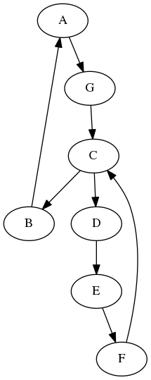
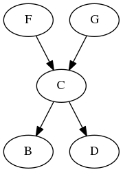

# grvutils

This repo contains a set of packages and tools for working with GraphViz graph files. 

Specific packages:

* zgr -- a graph package to represent the contents of a GraphViz graph; includes interfaces and methods for examining grpah nodes, edges, and properties
* grlex -- lexical analyzer for tokenizing a GraphVis file
* grparse -- package to parse a GraphViz file into a zgr.Graph
* grpune -- this package provides a method for pruning a given graph to create a subgraph. Here "prune" means starting at a specific root node and walking forward (from a given node to its successors in the graph) and/or backward (from a given node to its predecessors in the graph)
* cmd/grpune -- a driver program for graph pruning/slicing. 

Examples:

```
% cat first.graph
cat cmd/grprune/testdata/g1.graphviz
digraph Y {
   "a" [label="A"]
   "b" [label="B"]
   "c" [label="C"]
   "d" [label="D"]
   "e" [label="E"]
   "f" [label="F"]
   "g" [label="G"]
   "c" -> "b" [x=y]
   "c" -> "d" [z=w]
   "d" -> "e" [q=r]
   "g" -> "c" [q=r]
   "f" -> "c" [b=1]
   "b" -> "a" [b=1]
   "e" -> "f" [b=1]
   "a" -> "g" [b=1]
}
```

Dot representation:



Running the grpune tool:

```
% grprune -d 1 -r c -o pruned1.graph -i first.graph 
% 
```

Dot representation of the output 'pruned1.graph' above:


